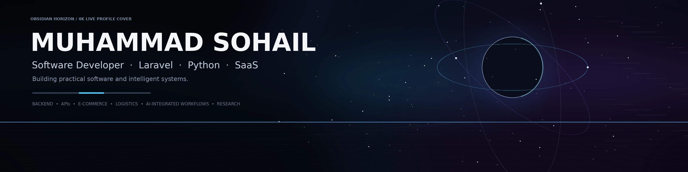

<!-- ═══════════════════════════════════════════════════════════
     Muhammad Sohail — GitHub Profile README
     Theme : Midnight Ivory
     Last updated : 2026-09
═══════════════════════════════════════════════════════════ -->

<!-- ─── HERO ──────────────────────────────────────────────── -->

 

<!-- ─── CONTACT BADGES ─────────────────────────────────────── -->

&nbsp;

&nbsp;

 

---

<!-- ─── ABOUT ──────────────────────────────────────────────── -->

## About

CS graduate and software developer. I build backend systems and SaaS products primarily with **Laravel/PHP** and **Python**, integrate REST APIs, third-party services, and AI where it adds real value.

My current focus is on e-commerce and logistics software — specifically problems around order workflows, COD/RTO reduction, and logistics integrations. Alongside product development, I conduct independent technical research into LLM agent memory systems.

---

<!-- ─── WHAT I BUILD ───────────────────────────────────────── -->

## What I Build

- **SaaS & web applications** — multi-tenant backend systems, business logic, workflow automation
- **E-commerce & logistics software** — order workflows, COD/RTO reduction, courier integrations, seller ops
- **API & system integrations** — REST APIs, webhooks, third-party service connections, background processing
- **AI-assisted application features** — LLM API integrations, AI-driven automation, intelligent system components
- **Technical research** — LLM agent memory, persistent memory architectures, reproducible experimentation

---

<!-- ─── CORE TECHNOLOGIES ──────────────────────────────────── -->

## Core Technologies

**Backend**

**Web & APIs**

**Data & Infrastructure**

**Environment & Tools**

---

<!-- ─── ENGINEERING WORK ───────────────────────────────────── -->

## Engineering Work

Most of my active product development is maintained in private repositories. My work focuses on practical backend and SaaS systems — in particular:

- **Laravel/PHP backend development** — authentication, business workflows, queues, application architecture
- **Python development** — backend services, automation, API layers, experimentation
- **E-commerce & logistics systems** — order management, fulfilment workflows, COD/RTO reduction, courier API integrations
- **SaaS application development** — multi-tenant architecture, subscription workflows, operational tooling
- **AI-assisted features** — LLM API integrations, intelligent automation within application workflows
- **MySQL & Redis** — relational data modelling, caching, session and queue-backed workflows
- **Docker & Linux** — containerised development environments, Linux-based tooling

I build software that solves real operational problems. The work is product-focused, backend-heavy, and integration-intensive.

---

<!-- ─── RESEARCH ────────────────────────────────────────────── -->

## Research

I conduct ongoing independent technical research into **LLM agent memory systems**.

Areas of investigation:

- Persistent memory architectures for LLM-based agents
- Memory localization, selective revocation, and containment
- Reproducible experimental design and controlled evaluation
- Retrieval behaviour analysis across agent memory configurations

This is exploratory, ongoing work. No publications are claimed.

---

<!-- ─── CONNECT ─────────────────────────────────────────────── -->

## Connect

- **LinkedIn** — [linkedin.com/in/muhammad-sohail-63982b428](https://www.linkedin.com/in/muhammad-sohail-63982b428/)
- **Email** — [msohailbuzdar42@gmail.com](mailto:msohailbuzdar42@gmail.com)
- **GitHub** — [github.com/Sohail-Mehdi](https://github.com/Sohail-Mehdi)

---

Muhammad Sohail &nbsp;·&nbsp; Software Developer &nbsp;·&nbsp; Laravel &nbsp;·&nbsp; Python &nbsp;·&nbsp; SaaS

